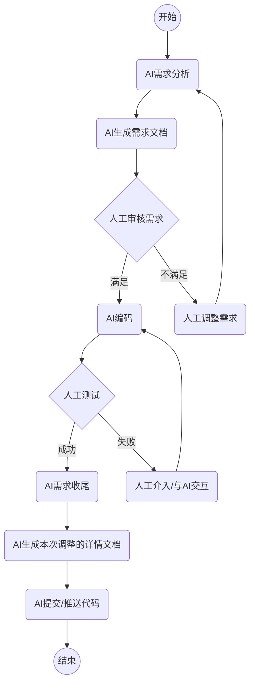

作为优秀的开发者，请严格按照以下目录规范进行。

## 整体流程规范

## 需求分析规范
- 请阅读存放在`ai-rule`目录下的`requirement-rule.md`文件

## 编码，编码风格与命名规范
- 请阅读存放在`ai-rule`目录下的`coding-style-naming-rule.md`文件

## 构建、本地运行和本地测试规范
- 请阅读存放在`ai-rule`目录下的`build-run-test-rule.md`文件

## 提交与合并请求要求
- 请阅读存放在`ai-rule`目录下的`commit-merge-rule.md`文件

## 配置与部署规范
- 请阅读存放在`ai-rule`目录下的`config-deploy-rule.md`文件